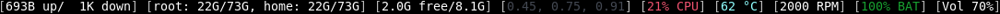

# Status Bar

A multi-threaded status bar for [dwm](https://dwm.suckless.org/).

Currently, it displays this *system* information:
* Network usage (download and upload)
* Disk usage
* Memory usage
* CPU usage (total and load)
* CPU temp
* Fan speed
* Battery status
* System volume
* Wifi status
* Time

... and this *user* information:
* TODO list updates
* Weather (current and forecasted)

# Table of Contents #
* [Prerequisites](#prerequisites)
* [Recommendations](#recommendations)
* [Installation](#installation)
* [Usage](#usage)
* [Getting Started](#getting-started)
	* [Disk routine](#disk-routine)
	* [Time routine](#time-routine)
	* [TODO routine](#todo-routine)
	* [Weather routine](#weather-routine)
	* [Colors](#colors)
* [Contributing](#contributing)
* [Author](#author)
* [License](#license)
* [Acknowledgments](#acknowledgments)

## Prerequisites ##
Status Bar requires 3 libraries for compilation:
* pthread
* m
* X11

These should already be installed, and you shouldn't need to do anything about them.

There are additional requirements for individual routines. If your machine does not have a library installed that
a certain routine needs, then that routine will be skipped during compilation. This is all handled by
[Autotools](https://www.gnu.org/software/automake/manual/html_node/Autotools-Introduction.html),
particularly [Autoconf and configure.ac](https://www.gnu.org/software/autoconf/autoconf.html).

These are the routine-specific libraries:
* Volume: libasound2
* Weather: [libcurl](https://curl.haxx.se/libcurl/)

Beyond that, if a routine is not being built like you expected, check the output for `./configure` (saved in config.log)
and the header checks in configure.ac to see what is missing.

## Recommendations ##
Status Bar works best with Andrew Milkovich's [dualstatus patch](https://dwm.suckless.org/patches/dualstatus/), which
allows for displaying more information. If you choose not to use this patch in your setup, you should remove the
semicolon separator that divides the top and bottom bars by removing `DELIMITER` from your chosen routines in config.h.

All output is colored with [Clément Sipieter's](https://github.com/sipi) [status2d patch](https://dwm.suckless.org/patches/status2d/).
If you do not use this patch, you should set `color_text` to `SB_FALSE` in config.h.

## Installation ##
